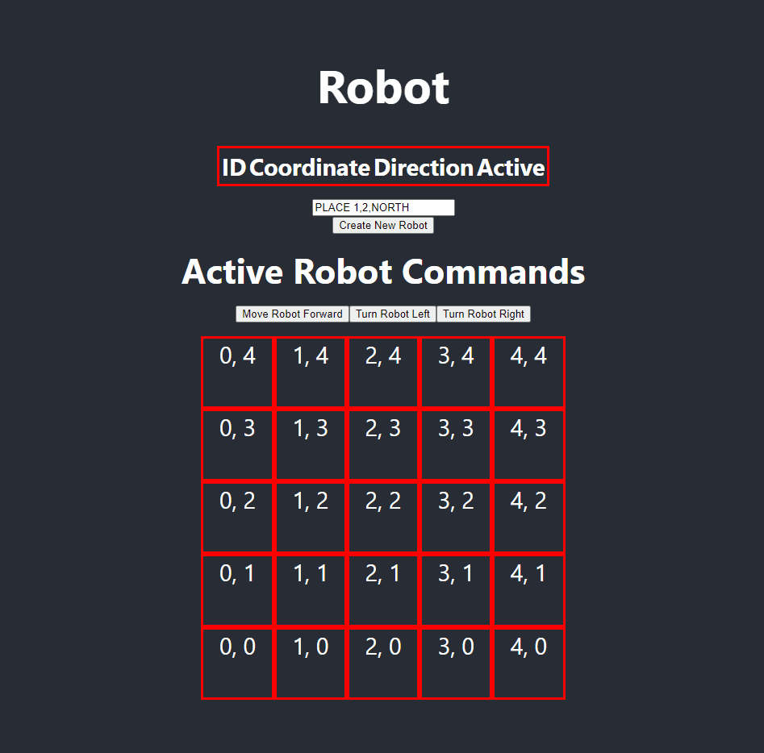

# Robot

## Available Scripts

Project is currently hosted on

### `https://luketellis.github.io/robot/`

In the project root directory, you can run:

### `npm start`

Runs the app in the development mode.\
Open [http://localhost:3000](http://localhost:3000) to view it in the browser.

Cypress tests can be run with:

### `npm run cypress`

Jest tests can be run with:

### `npm run test`

## Example Run

## Challenge Statement

## Description

The application is a simulation of a toy robot moving on a square tabletop, of dimensions 5 units x 5 units.

There are no other obstructions on the table surface.

The robot is free to roam around the surface of the table, but must be prevented from falling to destruction. Any movement that would result in the robot falling from the table must be prevented, however further valid movement commands must still be allowed.

Create an application that can read in commands of the following form

PLACE X,Y,F
MOVE
LEFT
RIGHT
REPORT
Where PLACE will put the toy robot on the table in position X,Y and facing NORTH, SOUTH, EAST or WEST. The origin (0,0) can be considered to be the SOUTH WEST most corner.

It is required that the first command to the robot is a PLACE command, after that, any sequence of commands may be issued, in any order, including another PLACE command. The application should discard all commands in the sequence until a valid PLACE command has been executed.

Where MOVE will move the toy robot one unit forward in the direction it is currently facing.

Where LEFT and RIGHT will rotate the robot 90 degrees in the specified direction without changing the position of the robot.

Where REPORT will announce the X,Y and facing of the robot. This can be in any form, but standard output is sufficient.

A robot that is not on the table can choose the ignore the MOVE, LEFT, RIGHT and REPORT commands.

Input can be from a file, or from standard input, as the developer chooses.

Provide test data to exercise the application.

## Constraints

The toy robot must not fall off the table during movement. This also includes the initial placement of the toy robot. Any move that would cause the robot to fall must be ignored.

Example Input and Output:

a)
PLACE 0,0,NORTH
MOVE
REPORT

Output: 0,1,NORTH

b)
PLACE 0,0,NORTH
LEFT
REPORT

Output: 0,0,WEST

c)
PLACE 1,2,EAST
MOVE
MOVE
LEFT
MOVE
REPORT

Output: 3,3,NORTH

## Extension

Multiple robots will operate on the table

The existing system above should continue to work as-is. REPORT will also now report on how many robots are present and which robot is active (see the ROBOT command later).

PLACE will add a new robot to the table with incrementing number identifier, i.e. the first placed robot will be 'Robot 1', then the next placed robot will be 'Robot 2', then 'Robot 3', etc.

A ROBOT <number> command will make the robot identified by active i.e. subsequent commands will affect that robot's position/direction. Any command that affects position/direction (e.g. MOVE, LEFT, RIGHT...) will affect only the active robot.

By default the first robot placed will become the active robot.
